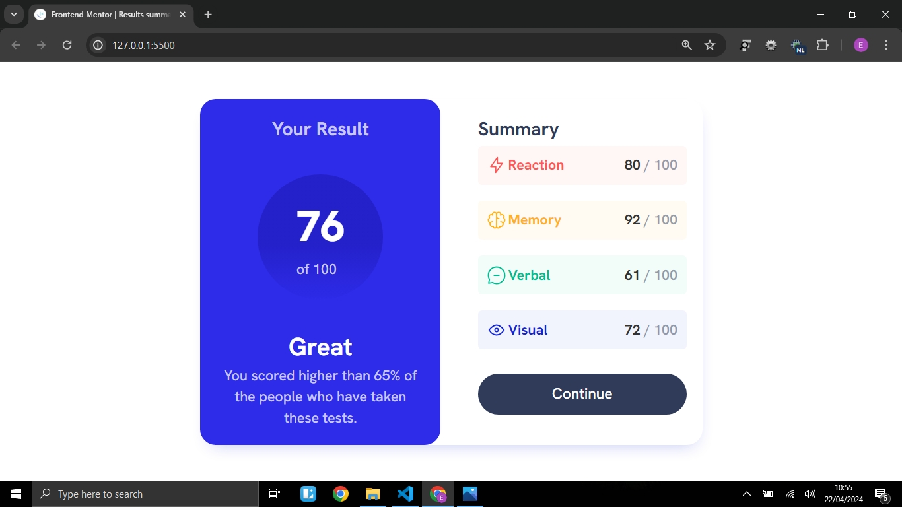

# Frontend Mentor - Results summary component solution

This is a solution to the [Results summary component challenge on Frontend Mentor](https://www.frontendmentor.io/challenges/results-summary-component-CE_K6s0maV). Frontend Mentor challenges help you improve your coding skills by building realistic projects. 

## Table of contents

- [Overview](#overview)
  - [The challenge](#the-challenge)
  - [Screenshot](#screenshot)
  - [Links](#links)
- [My process](#my-process)
  - [Built with](#built-with)
  - [What I learned](#what-i-learned)
  - [Continued development](#continued-development)
  - [Useful resources](#useful-resources)
- [Author](#author)


## Overview

### The challenge

Users should be able to:

- View the optimal layout for the interface depending on their device's screen size
- See hover and focus states for all interactive elements on the page

### Screenshot



Screenshot of my solution. 

### Links

- Solution URL : 

## My process

### Built with

- Semantic HTML5 markup
- CSS custom properties
- Flexbox
- CSS Grid
- Mobile-first workflow

### What I learned

```html
    <p>
        <strong> Great </strong>  
        You scored higher than 65% of the
        people who have taken these tests.
    </p>
```
```css
.summary-list {
    list-style-type: none;
}
```

### Continued development

I appreciate having tried out this project challenge, because it has given me a chance to apply my newly learnt skills in basic HTML and CSS. 

Am looking forward to doing more practice by taking more challenges to expand my knowledge and  learning other web technologies.

### Useful resources

- (https://www.fluid-type-scale.com) - Helped me to apply a basic responsive font-size scale

## Author

- Frontend Mentor - (https://www.frontendmentor.io/profile/emanueltenik)